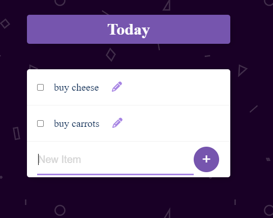

# Permalist Project

## Description

- Developed a dynamic to-do list application using Express.js and PostgreSQL, providing efficient task management with persistent data storage.
- Integrated a PostgreSQL database to handle tasks, allowing users to seamlessly add, edit, and delete items.

## Features

- Utilized EJS templates to render dynamic content on the server-side, ensuring a responsive and user-friendly interface.
- Implemented functionalities like adding, editing, and deleting tasks with automatic database updates.
- Responsive design achieved through CSS, enhancing the overall user experience.

## Technologies Used

- **Backend:** Node.js, Express.js, PostgreSQL for robust database management.
- **Frontend:** EJS (Embedded JavaScript), HTML, CSS for creating a dynamic and responsive UI.

## Database Connection

- Established a secure connection to the PostgreSQL database, enabling seamless CRUD operations for efficient item management.

## How to Use

1. Clone the repository.
2. Run the application using `nodemon index.js`.
3. Access the to-do list application at `http://localhost:3000` in your web browser.

## Screenshots

Feel free to explore, contribute, and improve the Permalist project!
